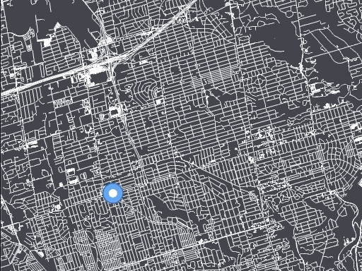

# Map Pathfinding Visualizer 

Interactive app that animates pathfinding algorithms as it searches in a real-world map. Try it out [here](https://pathfinding-viz.herokuapp.com/)!
## Purpose
I've seen many interactive, grid-based pathfinding visualizers (I even built a very 
[simple one](https://github.com/balucas/pathfinding-viz)!) and I've always wondered what the
algorithm would look like on an actual map. Additionally, I began this project to learn graphics/WebGL.